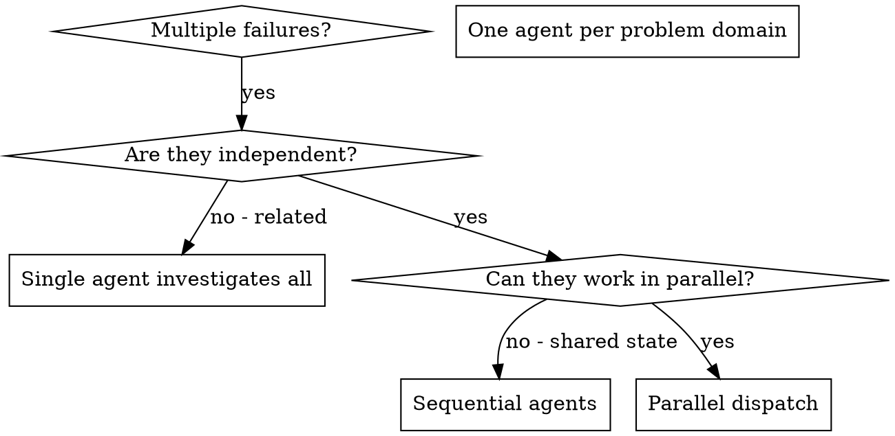

> **Related skills:** Debug each problem with `/skill:systematic-debugging`. Verify all fixes with `/skill:verification-before-completion`.

# Dispatching Parallel Agents

## Overview

When you have multiple **independent tasks** — unrelated test failures, or implementation tasks from a plan wave — that touch disjoint files, running them sequentially wastes time. Each can happen in parallel.

**Core principle:** Dispatch one agent per independent problem domain (one bug, one subsystem, or one plan task). Let them work concurrently.

This skill is the **mechanic home** for parallel fan-out: fresh-context isolation, `worktree: true` filesystem isolation, and serial patch integration. `subagent-driven-development`'s Parallel-Wave Mode builds its per-wave dispatch on this skill — debugging is the worked example below, but the mechanics are identical for implementation tasks.

**Why parallel subagents:** each agent gets a fresh context window with only its problem domain. No cross-contamination between investigations, smaller diffs, faster wall-clock time. You stay the orchestrator — you read the summaries, resolve any file overlap, and run the integrated tests.

**Fresh context is not the default.** Some packaged subagents (including `worker`) fork the parent context unless you opt out. Always pass `context: "fresh"` on every task entry — if it's missing, you're getting forked agents and losing the isolation that makes parallel dispatch worth doing in the first place.

## When to Use



**Use when:**
- 3+ test files failing with different root causes
- Multiple subsystems broken independently
- Each problem can be understood without context from others
- No shared state between investigations

**Don't use when:**
- Failures are related (fix one might fix others)
- Need to understand full system state
- Agents would interfere with each other

## The Pattern

### 1. Identify Independent Domains

Group failures by what's broken:
- File A tests: Tool approval flow
- File B tests: Batch completion behavior
- File C tests: Abort functionality

Each domain is independent - fixing tool approval doesn't affect abort tests.

### 2. Create Focused Agent Tasks

Each agent gets:
- **Specific scope:** One test file or subsystem
- **Clear goal:** Make these tests pass
- **Constraints:** Don't change other code
- **Expected output:** Summary of what you found and fixed

### 3. Dispatch in Parallel

**How to dispatch:**

Use the `subagent` tool in parallel mode, with explicit fresh context per task:

```ts
subagent({
  context: "fresh",
  tasks: [
    { agent: "worker", task: "Fix agent-tool-abort.test.ts failures" },
    { agent: "worker", task: "Fix batch-completion-behavior.test.ts failures" },
    { agent: "worker", task: "Fix tool-approval-race-conditions.test.ts failures" },
  ],
})
```

The top-level `context: "fresh"` applies to every task in the batch. Omitting it produces parallel-but-forked agents that share parent history — the worst of both worlds.

**Editing tasks:** add `worktree: true` so each task's writes are isolated in its own git worktree (see [pi-cohort Integration](#pi-cohort-integration)); omit it only for read-only investigations.

### 4. Review and Integrate

When agents return:
- Read each summary
- Verify fixes don't conflict
- Run full test suite
- Integrate all changes

**If agents edited the same files (textual conflict):** the orchestrator does **not** hand-merge code. Prefer re-running one agent sequentially with the other's integrated changes as context, so it adapts. Manual per-hunk merge is a last resort. (Avoid this entirely by giving each agent disjoint files — see the file-ownership contract in `writing-plans`.)

**If integrated changes apply cleanly but the suite fails (semantic conflict):** agents made incompatible assumptions across disjoint files (renamed symbol, changed shape). Diagnose the incompatible pair and re-run the offending task sequentially on the integrated HEAD.

**If some agents failed:** Integrate successful agents first (commit their work). Then retry the failed agent with fresh context that includes the integrated changes.

## Agent Prompt Structure

Good agent prompts are:
1. **Focused** - One clear problem domain
2. **Self-contained** - All context needed to understand the problem
3. **Specific about output** - What should the agent return?

```markdown
Fix the 3 failing tests in src/agents/agent-tool-abort.test.ts:

1. "should abort tool with partial output capture" - expects 'interrupted at' in message
2. "should handle mixed completed and aborted tools" - fast tool aborted instead of completed
3. "should properly track pendingToolCount" - expects 3 results but gets 0

These are timing/race condition issues. Your task:

1. Read the test file and understand what each test verifies
2. Identify root cause - timing issues or actual bugs?
3. Fix by:
   - Replacing arbitrary timeouts with event-based waiting
   - Fixing bugs in abort implementation if found
   - Adjusting test expectations if testing changed behavior

Do NOT just increase timeouts - find the real issue.

Return: Summary of what you found and what you fixed.
```

## Common Mistakes

**❌ Too broad:** "Fix all the tests" - agent gets lost
**✅ Specific:** "Fix agent-tool-abort.test.ts" - focused scope

**❌ No context:** "Fix the race condition" - agent doesn't know where
**✅ Context:** Paste the error messages and test names

**❌ No constraints:** Agent might refactor everything
**✅ Constraints:** "Do NOT change production code" or "Fix tests only"

**❌ Vague output:** "Fix it" - you don't know what changed
**✅ Specific:** "Return summary of root cause and changes"

## When NOT to Use

**Related failures:** Fixing one might fix others - investigate together first
**Need full context:** Understanding requires seeing entire system
**Exploratory debugging:** You don't know what's broken yet
**Shared state:** Agents would interfere (editing same files, using same resources)

## pi-cohort Integration

Parallel dispatch rides on the `subagent` tool (the pi-cohort package). Mechanics that matter here:

- **Parallel mode** — pass a `tasks` array; entries run concurrently. `concurrency` (default 4) caps how many run at once.
- **Context** — `context: "fresh"` at the top level applies to every task. Mandatory here (see above); without it `worker` forks parent history and you lose isolation.
- **Filesystem isolation** — `worktree: true` runs each task in its own git worktree so concurrent edits can't collide. Requires clean git state; each task's diff returns separately for you to integrate. Omit it for read-only investigations.
- **Worktree base / `cwd`** — under `worktree: true` the base commit is `HEAD` resolved from the **top-level `cwd`**, which defaults to the orchestrator's process cwd. When you orchestrate from inside a git worktree, pass that worktree's absolute path as the top-level `cwd`, or children branch from the wrong checkout. Don't set per-task `cwd` with `worktree: true` — it must equal the shared cwd or the run errors.
- **Agent choice** — `worker` is the pi-cohort builtin generalist. Use a persona (`implementer`, `code-reviewer`) when you want its system prompt and tool profile. Persona frontmatter (tools, thinking, context) is fixed; only `model`, `task`, `output`, `reads`, `progress`, `skill` are callable per task.
- **Output capture** — `output: "<file>"` writes a task's summary to a file instead of inline; add `outputMode: "file-only"` for large results.

```ts
subagent({
  context: "fresh",
  worktree: true,        // isolate edits; omit for read-only investigations
  concurrency: 3,
  tasks: [
    { agent: "worker", task: "Fix + explain failures in src/a.test.ts", output: "a.md" },
    { agent: "worker", task: "Fix + explain failures in src/b.test.ts", output: "b.md" },
    { agent: "worker", task: "Fix + explain failures in src/c.test.ts", output: "c.md" },
  ],
})
```

For chains, async runs, intercom coordination, and the full agent roster, read the `pi-cohort` skill — this skill covers only the parallel fan-out case.

## Verification

After agents return:
1. **Review each summary** - Understand what changed
2. **Check for conflicts** - Did agents edit same code?
3. **Run full suite** - Verify all fixes work together
4. **Spot check** - Agents can make systematic errors

## Project overrides

If `.pi/gauntlet-overrides.md` exists, read it. Any sections relevant to this skill — by name match, by topic (routing, verification, worktrees, etc.), or by workflow convention — override or extend the instructions above. Project-local `AGENTS.md` is already in context — check it for project-specific routing tables, service paths, and verification commands.
